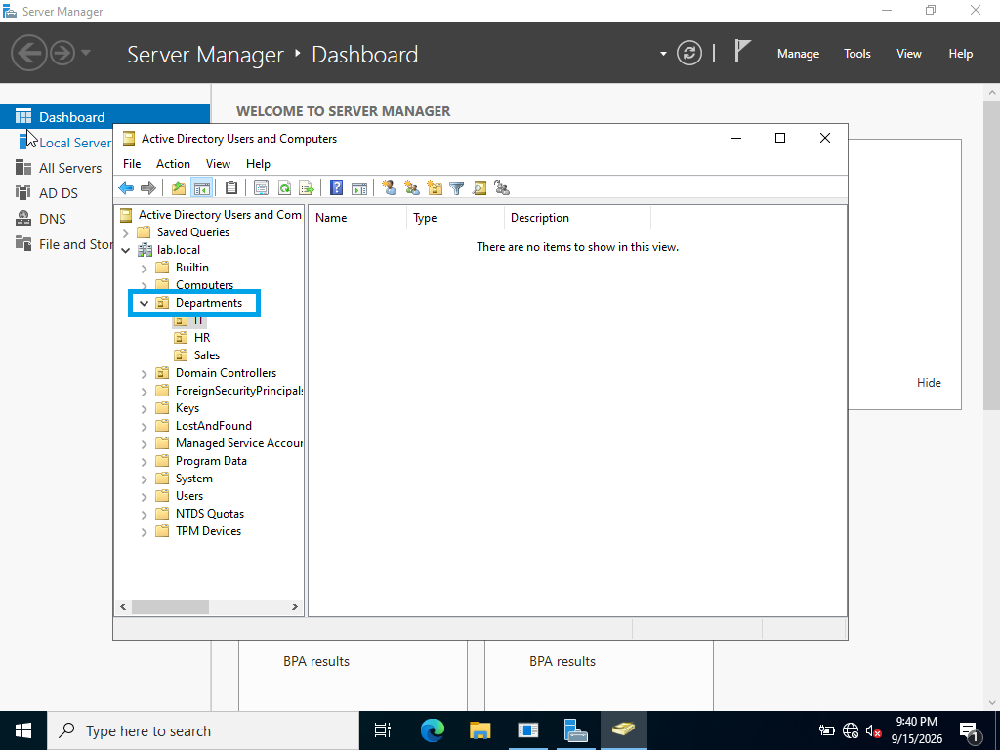

# Department Creation

Created departments in Active Directory to organize users according to their respective areas.

## Screenshot

## What I Did
Tools > AD Users and Computers > Right Click lab.local > New > Org Unit >  Name: Departments
- Opened Active Directory Users and Computers (ADUC)
- Created the required department structure
- Organized departments within the appropriate domain structure

## Skills Demonstrated

- Active Directory administration
- Organizational management
- ADUC
