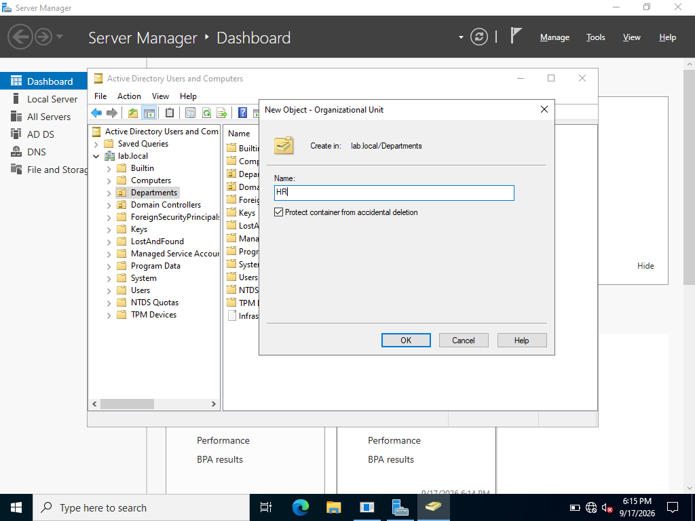

### Organizational Units by Department

Created and organized Organizational Units (OUs) within the IT, HR, and Sales departments to separate and manage users and resources based on their respective departments.
Under lab.local > Right Click Departments > New > Org Unit 

#### IT Department

#### HR Department

#### Sales Department

