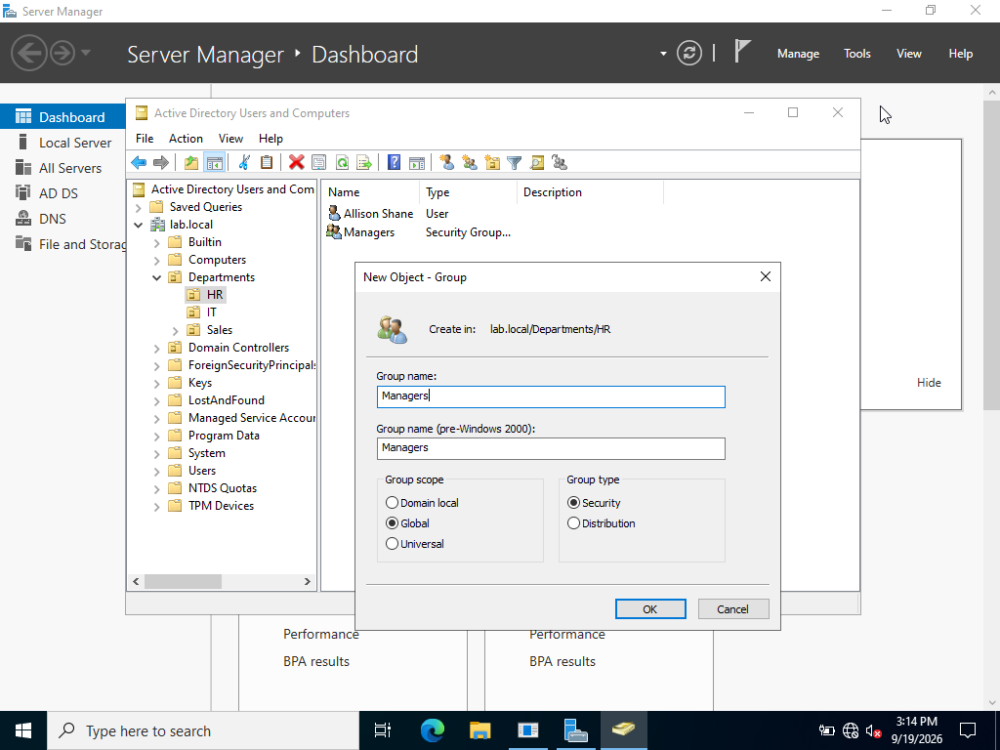

### Creating Security Groups for Every Department

Created security groups for the IT, HR, and Sales departments and organized them within their corresponding Organizational Units (OUs).

lab.local > Right Click Departments > New > Groups

#### IT Department

#### HR Department

