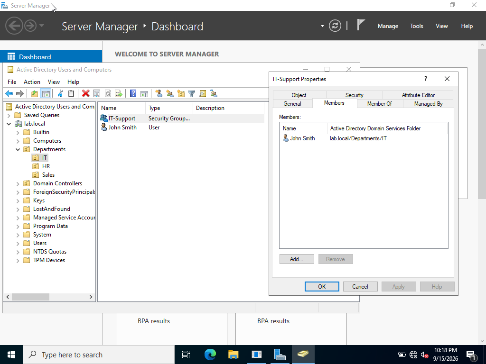

### Adding Users to Security Groups

Added users to their corresponding departmental security groups to manage access and permissions based on their department.

By assigning users to security groups, permissions can be managed at the group level instead of configuring access for each user individually. This makes user and access management easier to maintain as the organization grows.

#### IT Department

Added IT users to the IT security group.

#### HR Department

Added HR users to the HR security group.

