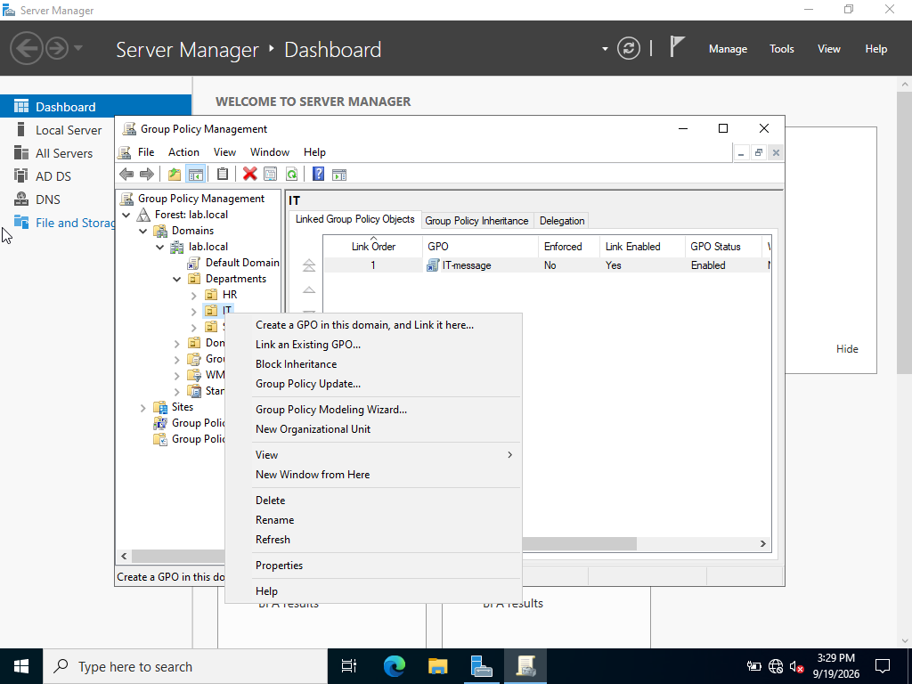
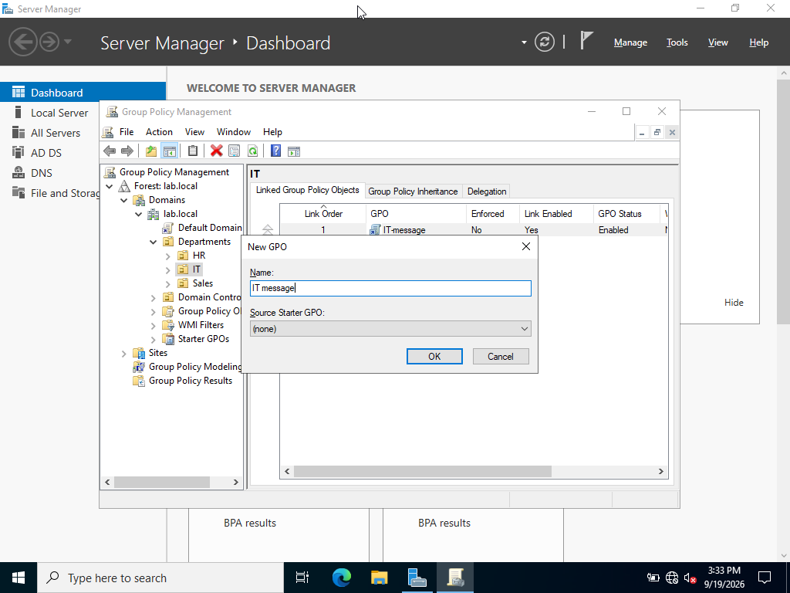
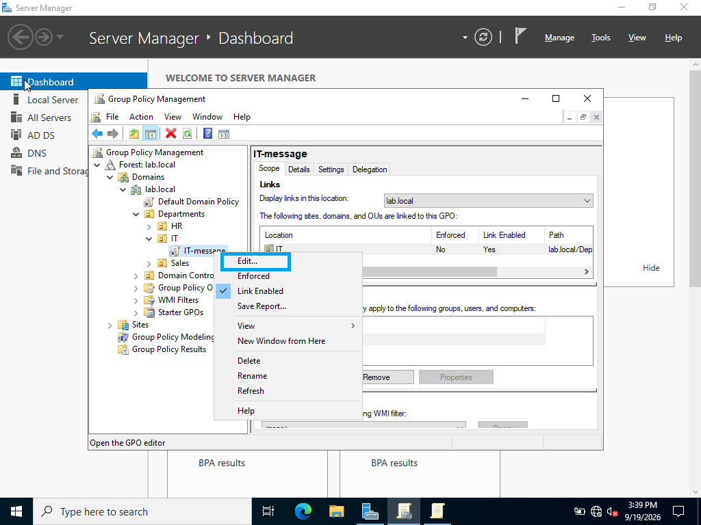
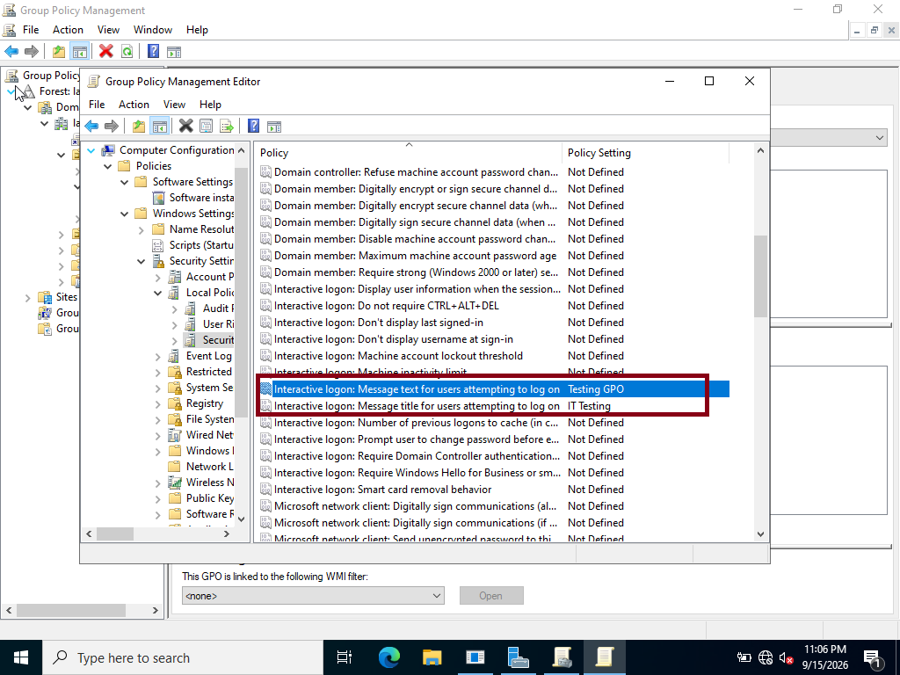

### Creating, Linking, and Applying a GPO

Created a Group Policy Object (GPO) to configure centralized settings for computers within the Active Directory environment. The GPO was linked to the appropriate Organizational Unit (OU) so that its settings could be applied to the computers and users within that OU.

After configuring the GPO, verified that the policy was successfully applied to CLIENT01.

Tools > GPO

#### Creating the GPO

Created a new GPO using the Group Policy Management Console (GPMC).

Click Create a GPO in this domain, and link it here...

Name it: IT message 

Right click > IT message > Edit

Computer Configuration > Policies > Windows Settings > Security Settings > Local Policies > Security Options 

#### Test the GPO

